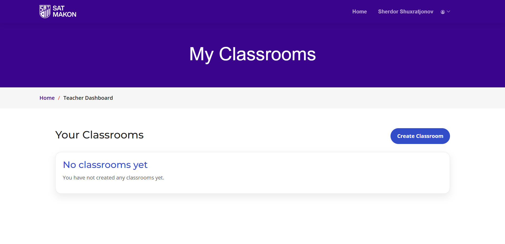
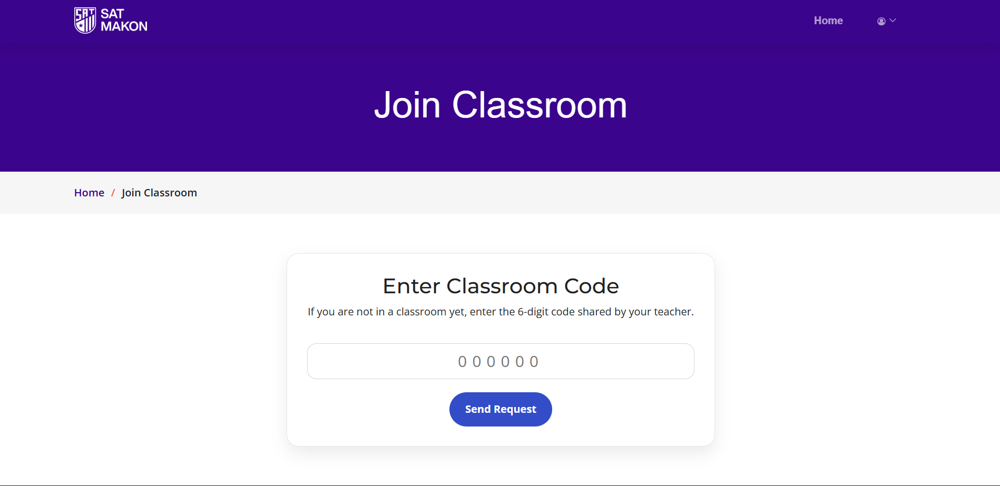
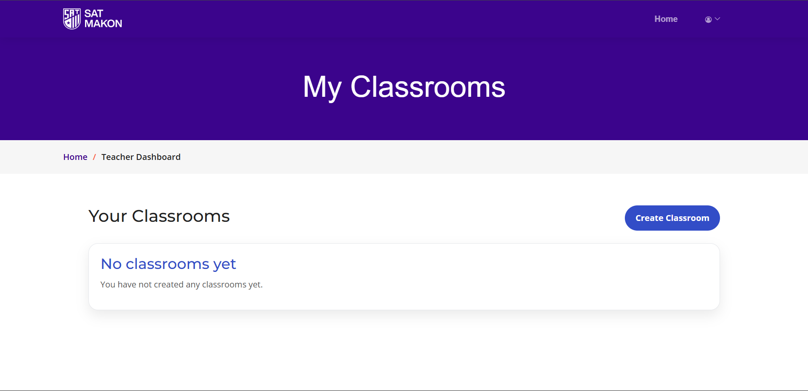
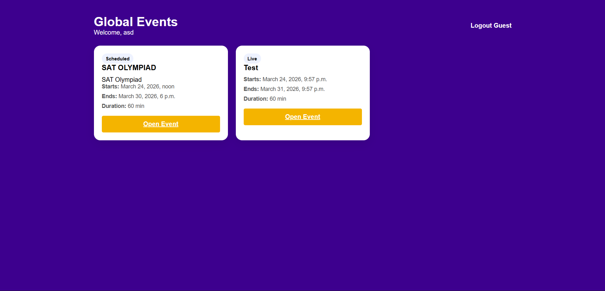

# MakonBook SAT

MakonBook SAT — это веб-платформа для подготовки к SAT, где ученики могут проходить практические тесты, изучать vocabulary и отслеживать свой прогресс, а учителя — управлять classroom, материалами и результатами учеников.

## Основные возможности

- SAT practice tests
- Vocabulary sections and units
- Admissions materials
- Личный кабинет ученика
- Teacher dashboard
- Classroom system с кодом присоединения
- Отслеживание прогресса учеников
- Leaderboard
- Guest mode
- Admin panel for content management

## Роли пользователей

### Student

- проходит тесты;
- изучает vocabulary и другие материалы;
- отслеживает собственный прогресс;
- может состоять только в одном classroom.

### Teacher

- создает classroom;
- выдает ученикам доступ к отдельным секциям;
- отслеживает прогресс учеников по разделам;
- управляет участниками classroom;
- может удалять учеников из classroom или удалять classroom полностью.

### Guest

- получает ограниченный доступ к платформе без полноценного аккаунта;
- может проходить доступные тесты в гостевом режиме.

## Стек технологий

- **Backend:** Django 5
- **Database:** PostgreSQL
- **Frontend:** Django Templates, HTML, CSS, JavaScript
- **Storage:** Cloudflare R2 / S3-compatible storage
- **Bot integration:** Aiogram (optional)

## Структура проекта

```bash
makonbook/
├── apps/
│   ├── sat/
│   ├── users/
│   ├── classrooms/
│   └── ...
├── templates/
├── static/
├── media/
├── config/
├── manage.py
├── requirements.txt
└── README.md
bash```
Установка
1. Клонирование репозитория
git clone <your-repository-url>
cd makonbook

2. Создание виртуального окружения
Windows
py -3.12 -m venv .venv
.venv\Scripts\activate

Linux / macOS
python3 -m venv .venv
source .venv/bin/activate

3. Установка зависимостей
pip install -r requirements.txt

4. Настройка .env
Создай файл .env в корне проекта:
SECRET_KEY=your_secret_key
DEBUG=True
ALLOWED_HOSTS=127.0.0.1,localhost

DB_ENGINE=django.db.backends.postgresql
DB_NAME=makonbook_sat
DB_USER=postgres
DB_PASSWORD=your_password
DB_HOST=127.0.0.1
DB_PORT=5432

R2_ACCESS_KEY_ID=your_access_key
R2_SECRET_ACCESS_KEY=your_secret_key
R2_BUCKET_NAME=your_bucket_name

TELEGRAM_BOT_TOKEN=your_bot_token
EMAIL=your_email
EMAIL_PASSWORD=your_email_password

Настройка базы данных
Убедись, что PostgreSQL запущен и база данных makonbook_sat уже создана.
После этого выполни:
python manage.py makemigrations
python manage.py migrate

Создание суперпользователя
python manage.py createsuperuser

Запуск проекта
python manage.py runserver
После запуска сайт будет доступен по адресу:
http://127.0.0.1:8000/


Classroom System

Система classroom позволяет учителю управлять учебным процессом:

создавать classroom;
выдавать код присоединения;
контролировать доступ учеников к разделам;
отслеживать прогресс каждого ученика;
удалять учеников из classroom;
удалять classroom полностью.

SAT Modules
Practice Tests
прохождение тестов;
подсчет результатов;
отображение score;
leaderboard.
Vocabulary
разделение на unit / section;
управление доступом;
отслеживание прогресса.
Admissions
материалы и задания, связанные с поступлением;
доступ по настройкам учителя.
Guest Mode

Guest mode предназначен для пользователей, которые хотят попробовать часть функционала без создания полноценного аккаунта.

Admin Panel
Через Django admin можно:

управлять пользователями;
добавлять и редактировать тесты;
настраивать vocabulary и другие материалы;
модерировать контент платформы.
Планы по развитию
classroom chat;
отправка файлов в чате;
более детальная аналитика;
улучшенный leaderboard;
расширенный teacher dashboard;
уведомления через Telegram bot.

Скриншоты:





Автор: Islom Bakhtiyorov

License: This project is intended for educational use.
